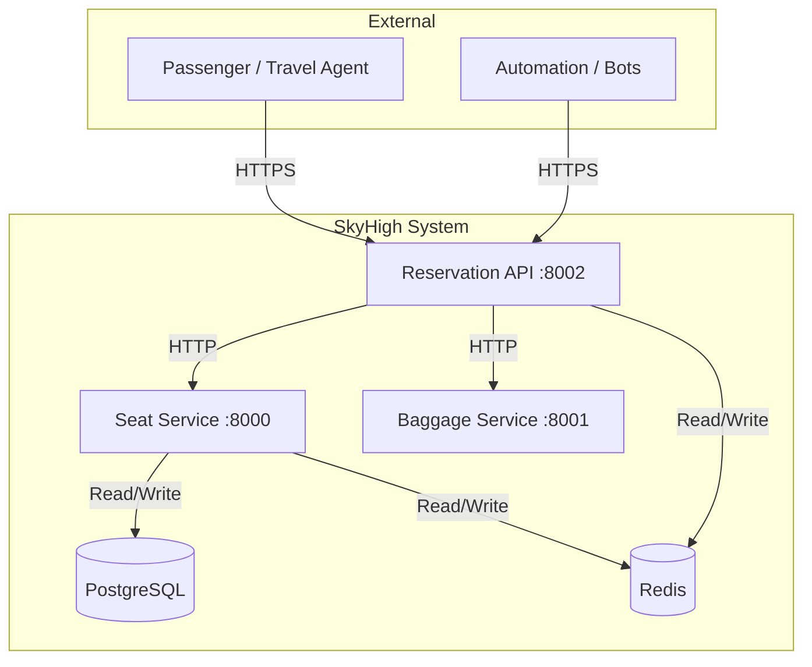
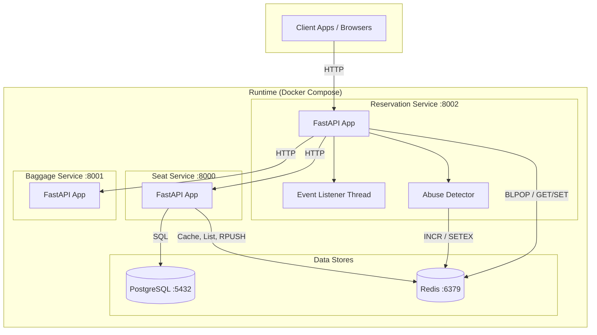
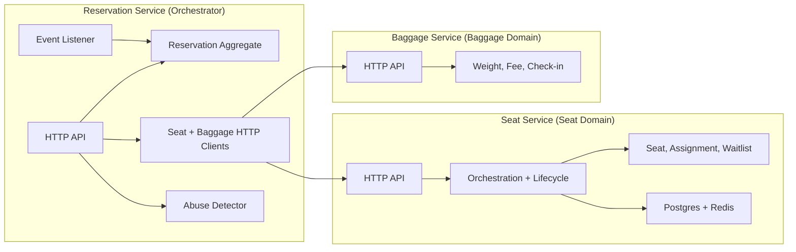
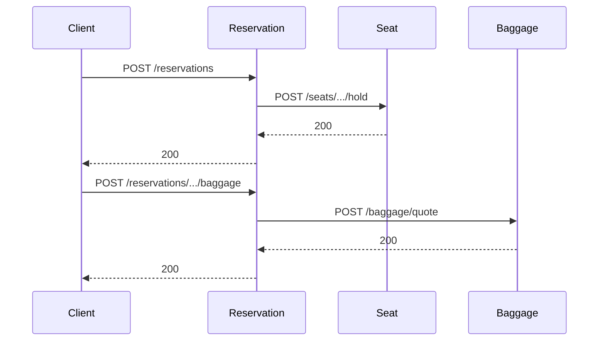
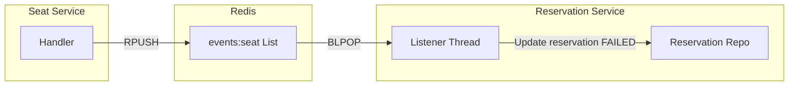
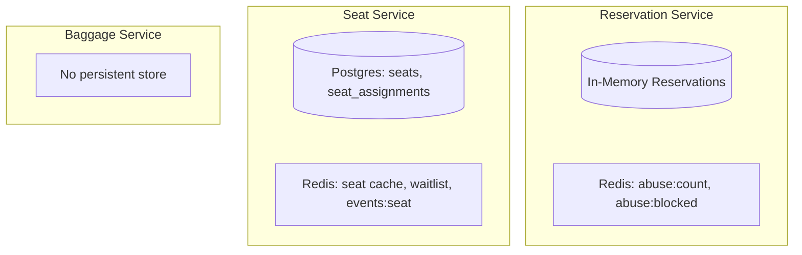
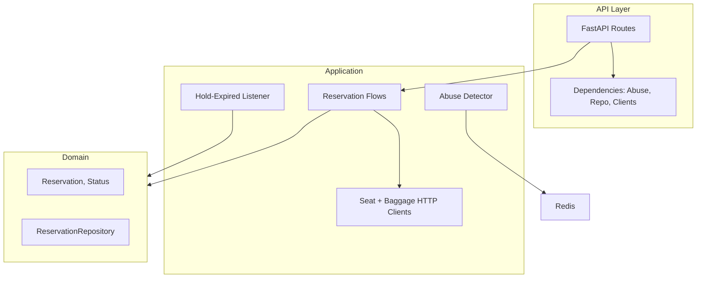
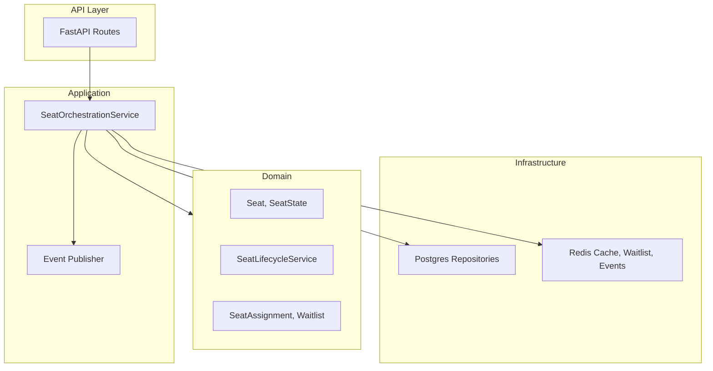

# Architecture

High-level architecture of the SkyHigh reservation system, with diagrams and design principles.

---

## 1. System Context

The system exposes a **single API** (Reservation Service) to clients. It coordinates **seat availability** and **baggage fees** via two backend microservices and uses **Postgres** and **Redis** for persistence and events.

**In plain terms:**

- **Users** (passengers, agents, or front-end apps) call only the **Reservation API**.
- **Reservation API** calls **Seat Service** and **Baggage Service** over HTTP and uses **Redis** for events and abuse detection.
- **Seat Service** uses **Postgres** (seats, assignments) and **Redis** (cache, waitlist, event queue).
- **Baggage Service** is stateless; no database in the diagram.

---

## 2. Container / Deployment View

How the system is run with Docker Compose: one process per service, shared Postgres and Redis.

**Dependencies:**

| Service            | Depends on        | Purpose                          |
|--------------------|-------------------|----------------------------------|
| Reservation        | Seat, Baggage     | Orchestration                    |
| Reservation        | Redis             | Events (hold-expired), abuse     |
| Seat               | Postgres, Redis   | Persistence, cache, waitlist     |
| Baggage            | —                 | Stateless                        |

---

## 3. Service Boundaries and Responsibilities

Each service owns a **bounded context** and its own data (or no persistent data).

| Service            | Owns                                                                 | Does not own                         |
|--------------------|----------------------------------------------------------------------|--------------------------------------|
| **Reservation**    | Reservation aggregate (id, passenger, flight, seat, status, baggage, fees). Abuse state (Redis or memory). | Seat state, assignments, waitlist, baggage rules. |
| **Seat**           | Seat lifecycle, assignments, waitlist. Seat cache and event stream.  | Reservations, baggage, abuse.        |
| **Baggage**        | Weight rules, fee calculation, check-in session model.              | Reservations, seats.                  |

---

## 4. Communication Patterns

### 4.1 Synchronous: HTTP

All **user-initiated** actions go through the Reservation API, which calls Seat and Baggage over **HTTP** (sync).

- **Reservation → Seat:** hold, hold-status, confirm, cancel, join waitlist.
- **Reservation → Baggage:** quote (weight → fee).
- Timeouts and retries are the responsibility of the reservation service (e.g. via HTTP client settings).

### 4.2 Asynchronous: Redis List (Events)

The **Seat Service** publishes domain events to a Redis list. The **Reservation Service** consumes them in a background thread to keep reservation status in sync (e.g. hold expired → reservation FAILED).

- **Producer:** Seat service (on hold expiry during confirm, or when another passenger takes a held seat).
- **Consumer:** Reservation service (filters for `HoldExpiredEvent`, updates matching reservation).
- **Shape:** Single list; consumer pulls and processes one event at a time.

---

## 5. Data Ownership and Storage

Who writes what, and where it lives.

| Data                  | Owner        | Storage              | Accessed by              |
|-----------------------|-------------|----------------------|--------------------------|
| Reservations          | Reservation | In-memory (current)  | Reservation only         |
| Abuse counters/block  | Reservation | Redis                | Reservation only         |
| Seat state            | Seat        | Postgres + Redis cache | Seat only              |
| Seat assignments      | Seat        | Postgres             | Seat only                |
| Waitlist              | Seat        | Redis list           | Seat only                |
| Seat events           | Seat        | Redis list           | Seat (write), Reservation (read) |
| Baggage rules / quote  | Baggage     | In-process           | Baggage only             |

There is **no shared database** between services; only **Redis** is shared for events and abuse, with clear key namespaces.

---

## 6. Layered View (Reservation and Seat Services)

Internal structure of the two main services.

### 6.1 Reservation Service

- **API:** HTTP endpoints and dependencies (abuse check, repo, clients).
- **Application:** Orchestration (create, add baggage, complete, cancel, waitlist), HTTP clients, event listener, abuse logic.
- **Domain:** Reservation aggregate and repository protocol; no direct dependency on Seat/Baggage types.

### 6.2 Seat Service

- **API:** Seat and waitlist HTTP endpoints.
- **Application:** Orchestration (hold, confirm, cancel, hold-status, join waitlist), event publishing.
- **Domain:** Seat lifecycle, assignments, waitlist types and services.
- **Infrastructure:** Postgres (seats, assignments) and Redis (cache, waitlist, event list).

---

## 7. Design Principles

| Principle | How it’s applied |
|-----------|-------------------|
| **Single client entry point** | All user traffic goes to the Reservation Service; no direct client calls to Seat or Baggage. |
| **Bounded contexts** | Reservation, Seat, and Baggage each own their domain and data; no shared domain models across services. |
| **Sync for commands** | User actions are carried out via HTTP from Reservation to Seat/Baggage so the response can reflect success or failure immediately. |
| **Async for reactions** | Hold-expired and similar side effects are propagated via Redis so Reservation can update state without the user waiting. |
| **No shared database** | Seat uses Postgres; Reservation uses in-memory (and Redis for abuse/events). Only Redis is shared, with separate key namespaces. |
| **Abuse at the edge** | Rate limiting and blocking are implemented in the Reservation Service, the only public API. |

---

## 8. Diagram Index

| Diagram | Section | Content |
|---------|---------|--------|
| System context | §1 | Users, Reservation API, Seat/Baggage, Postgres/Redis |
| Deployment | §2 | Containers and data stores |
| Service boundaries | §3 | Responsibilities and ownership per service |
| HTTP sequence | §4.1 | Sync calls Reservation → Seat/Baggage |
| Event flow | §4.2 | Redis list: Seat publishes, Reservation consumes |
| Data ownership | §5 | Where each data type is stored and who writes it |
| Reservation layers | §6.1 | API, application, domain inside Reservation Service |
| Seat layers | §6.2 | API, application, domain, infrastructure in Seat Service |

For flow-level detail (create reservation, complete, cancel, waitlist, abuse), see **WORKFLOW_DESIGN.md**.
