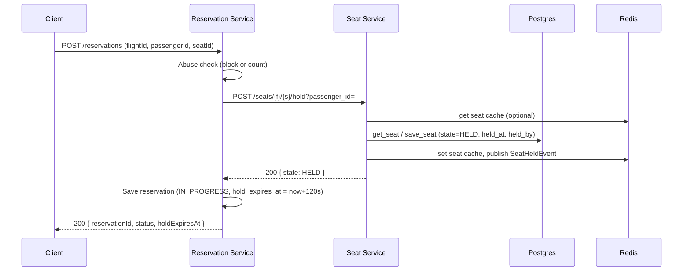
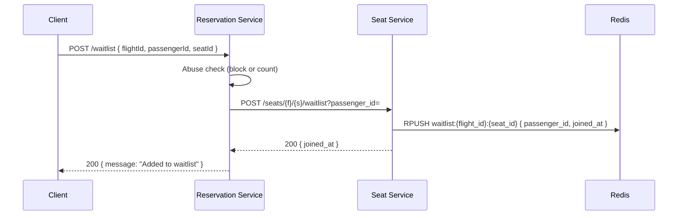

# Workflow Design

Implementation overview, flow diagrams, and data storage (database schema and Redis keys) for the SkyHigh reservation system.

---

## 1. Implementation Overview

### 1.1 Architecture

- **Reservation service** (port 8002): single client-facing API. Orchestrates seat and baggage via HTTP, owns the reservation aggregate (in-memory today), runs abuse detection and a hold-expired event listener.
- **Seat service** (port 8000): seat lifecycle (hold → confirm / expire, cancel), conflict-free assignments, waitlist. Uses **Postgres** (seats, assignments) and **Redis** (seat cache, waitlist, events).
- **Baggage service** (port 8001): baggage quote (weight → overweight fee). Stateless; no persistent schema.

Reservation and seat services share **Redis** for events and (in reservation) for abuse counters; reservation service is the only one that persists reservations (in-memory repository).

### 1.2 Key Design Choices

| Area | Choice | Rationale |
|------|--------|-----------|
| Seat consistency | Postgres `seats` + `seat_assignments` with UNIQUE on (flight_id, seat_id) | Single source of truth; INSERT on assign enforces one assignment per seat. |
| Hold expiry | 120s TTL; expiry applied on next read (lazy) or on confirm | Avoids a scheduler; seat service re-computes state on hold-status and confirm. |
| Events | Redis list `events:seat` (RPUSH by seat service, BLPOP by reservation) | Simple queue for HoldExpiredEvent so reservation service can mark reservations FAILED. |
| Abuse | Per-client (IP) rate limit on create-reservation and join-waitlist; temporary block (e.g. 5 min) | Limits rapid scanning of seat maps; block is stored in Redis or in-memory. |
| Reservation storage | In-memory dict in reservation service | Simplifies demo; can be replaced by Postgres/Redis without changing flows. |

### 1.3 Seat State Machine

```
                    hold (same passenger)
    AVAILABLE ──────────────────────────────► HELD
        ▲                                        │
        │                                        │ confirm
        │ expire (TTL 120s)                      ▼
        └────────────────────────────────── CONFIRMED
                                                    │
                                                    │ cancel (same passenger)
                                                    ▼
                                               CANCELLED
```

- **Hold**: AVAILABLE → HELD (one passenger, 120s TTL).
- **Confirm**: HELD → CONFIRMED (same passenger); creates a row in `seat_assignments`.
- **Expire**: HELD → AVAILABLE when `now >= held_at + 120s` (applied lazily).
- **Cancel**: CONFIRMED → CANCELLED; assignment row removed; waitlist may get the seat.

---

## 2. Flow Diagrams

### 2.1 Create Reservation (Hold Seat)



### 2.2 Add Baggage

```mermaid
sequenceDiagram
    participant C as Client
    participant R as Reservation Service
    participant B as Baggage Service

    C->>R: POST /reservations/{id}/baggage?additionalWeightKg=
    R->>R: Get reservation, validate status
    R->>B: POST /baggage/quote (flightId, passengerId, totalWeightKg)
    B-->>R: { overweightFee }
    R->>R: Update reservation (baggage_total_kg, overweight_fee); if fee>0 set AWAITING_PAYMENT
    R-->>C: 200 { baggageTotalKg, overweightFee, status }
```

### 2.3 Complete Reservation (Pay or Abandon)

```mermaid
sequenceDiagram
    participant C as Client
    participant R as Reservation Service
    participant S as Seat Service
    participant P as Postgres

    C->>R: POST /reservations/{id}/complete { "pay": true|false }
    R->>R: Get reservation; reject if already FAILED

    alt pay = true
        R->>S: GET /seats/{f}/{s}/hold-status?passenger_id=
        S->>S: Apply expiry; persist if expired
        S-->>R: { held, reason }
        alt held = false
            R->>R: Set reservation FAILED, save
            R-->>C: 400 "seat hold expired / released"
        else held = true
            R->>S: POST /seats/{f}/{s}/confirm?passenger_id=
            S->>P: Update seat CONFIRMED; INSERT seat_assignments
            S-->>R: 200
            R->>R: Set reservation COMPLETED, save
            R-->>C: 200 { status: COMPLETED }
        end
    else pay = false
        R->>R: Set reservation FAILED, save
        R-->>C: 200 { status: FAILED }
    end
```

### 2.4 Cancel Completed Reservation (Release Seat + Waitlist)

```mermaid
sequenceDiagram
    participant C as Client
    participant R as Reservation Service
    participant S as Seat Service
    participant P as Postgres
    participant Redis as Redis

    C->>R: POST /reservations/{id}/cancel
    R->>R: Get reservation; must be COMPLETED
    R->>S: POST /seats/{f}/{s}/cancel?passenger_id=
    S->>P: Update seat CANCELLED; DELETE from seat_assignments
    S->>Redis: LPOP waitlist:{f}:{s} (next passenger)
    alt waitlist entry exists
        S->>P: INSERT seat_assignments (waitlist passenger)
        S->>Redis: Publish WaitlistSeatAssignedEvent
    end
    S-->>R: 200
    R->>R: Set reservation CANCELLED, save
    R-->>C: 200 { status: CANCELLED }
```

### 2.5 Hold-Expired Event (Reservation → FAILED)

```mermaid
sequenceDiagram
    participant S as Seat Service
    participant Redis as Redis
    participant R as Reservation Service

    Note over S: Confirm attempted; hold had expired
    S->>S: Expire hold, save seat
    S->>Redis: RPUSH events:seat HoldExpiredEvent(flight_id, seat_id, passenger_id)
    S-->>Client: 400 HoldExpiredException

    loop Reservation listener (BLPOP events:seat)
        Redis->>R: HoldExpiredEvent
        R->>R: get_by_seat(flight_id, seat_id, passenger_id)
        R->>R: reservation.status = FAILED, save
    end
```

### 2.6 Join Waitlist



### 2.7 Abuse Detection (Rate Limit & Block)

```mermaid
flowchart LR
    A[Request to POST /reservations or POST /waitlist] --> B{Abuse dependency}
    B --> C{Client blocked?}
    C -->|Yes| D[429 + Retry-After]
    C -->|No| E[Record seat access]
    E --> F[INCR abuse:count:{client_id}]
    F --> G{Count >= 15 in window?}
    G -->|Yes| H[SET abuse:blocked:{client_id} TTL 300s]
    G -->|No| I[Continue to handler]
    H --> I
```

---

## 3. Database Schema and Redis Keys

### 3.1 PostgreSQL (Seat Service)

**Database:** `skyhigh` (or per env `DATABASE_URL`).

#### Table: `seats`

Stores the current state of each seat (one row per seat per flight).

| Column | Type | Nullable | Description |
|--------|------|----------|-------------|
| `flight_id` | TEXT | NOT NULL | Flight identifier. |
| `seat_id` | TEXT | NOT NULL | Seat identifier (e.g. 12A). |
| `state` | TEXT | NOT NULL | One of: AVAILABLE, HELD, CONFIRMED, CANCELLED. |
| `held_by_passenger_id` | TEXT | YES | Passenger who currently holds (when state = HELD). |
| `held_at` | TIMESTAMPTZ | YES | When the hold started (for TTL). |
| `confirmed_for_passenger_id` | TEXT | YES | Passenger who confirmed (when state = CONFIRMED). |
| `confirmed_at` | TIMESTAMPTZ | YES | When the seat was confirmed. |
| `cancelled_at` | TIMESTAMPTZ | YES | When the seat was cancelled (when state = CANCELLED). |

**Primary key:** `(flight_id, seat_id)`  
**Indexes:** PK only (lookup by flight + seat).

```sql
CREATE TABLE seats (
    flight_id TEXT NOT NULL,
    seat_id   TEXT NOT NULL,
    state     TEXT NOT NULL,
    held_by_passenger_id TEXT,
    held_at   TIMESTAMPTZ,
    confirmed_for_passenger_id TEXT,
    confirmed_at TIMESTAMPTZ,
    cancelled_at TIMESTAMPTZ,
    PRIMARY KEY (flight_id, seat_id)
);
```

#### Table: `seat_assignments`

Authoritative record of which passenger has been assigned which seat (conflict-free; one row per seat).

| Column | Type | Nullable | Description |
|--------|------|----------|-------------|
| `flight_id` | TEXT | NOT NULL | Flight identifier. |
| `seat_id` | TEXT | NOT NULL | Seat identifier. |
| `passenger_id` | TEXT | NOT NULL | Passenger who owns the assignment. |
| `assigned_at` | TIMESTAMPTZ | NOT NULL | When the assignment was created. |

**Primary key:** `(flight_id, seat_id)`  
**Unique:** `(flight_id, seat_id)` so only one assignment per seat; INSERT used for atomic “assign if free.”

```sql
CREATE TABLE seat_assignments (
    flight_id   TEXT NOT NULL,
    seat_id     TEXT NOT NULL,
    passenger_id TEXT NOT NULL,
    assigned_at TIMESTAMPTZ NOT NULL,
    PRIMARY KEY (flight_id, seat_id),
    UNIQUE (flight_id, seat_id)
);
```

### 3.2 Redis (Seat Service)

| Key pattern | Type | TTL / usage | Purpose |
|-------------|------|-------------|---------|
| `seat:{flight_id}:{seat_id}` | String (JSON) | Set on write | Cache for seat state; reduces Postgres reads. |
| `waitlist:{flight_id}:{seat_id}` | List | None | FIFO queue of waitlist entries (JSON per element): `{ flight_id, seat_id, passenger_id, joined_at }`. |
| `events:seat` | List | None | Event queue: JSON objects with `type` (e.g. SeatHeldEvent, HoldExpiredEvent, SeatConfirmedEvent, SeatCancelledEvent, WaitlistSeatAssignedEvent) and event fields. |

### 3.3 Redis (Reservation Service)

| Key pattern | Type | TTL / usage | Purpose |
|-------------|------|-------------|---------|
| `abuse:count:{client_id}` | String (integer) | 60s (sliding window) | Number of seat-access requests in current window. |
| `abuse:blocked:{client_id}` | String | 300s | Client is blocked; presence = blocked. |

### 3.4 Reservation Data (Reservation Service)

Reservations are stored **in memory** in a dictionary keyed by `reservation_id`. No Postgres or Redis schema for reservations in the current implementation. Logical fields:

| Field | Type | Description |
|-------|------|-------------|
| `reservation_id` | str | Unique ID (e.g. R-{timestamp}-{passengerId}). |
| `passenger_id` | str | Passenger. |
| `flight_id` | str | Flight. |
| `seat_id` | str | Seat. |
| `created_at` | datetime | Creation time. |
| `status` | enum | IN_PROGRESS, AWAITING_PAYMENT, FAILED, COMPLETED, CANCELLED. |
| `baggage_total_kg` | float | Total baggage weight. |
| `overweight_fee` | float | Fee from baggage service. |
| `hold_expires_at` | datetime | When the seat hold expires (e.g. created_at + 120s). |

---

## 4. Configuration Summary

| Component | Env / config | Default / note |
|-----------|--------------|----------------|
| Seat service | `DATABASE_URL` | Postgres DSN (e.g. postgres://.../skyhigh). |
| Seat service | `REDIS_URL` | Redis DSN (e.g. redis://redis:6379/0). |
| Reservation service | `SEAT_SERVICE_URL` | http://seat-service:8000. |
| Reservation service | `BAGGAGE_SERVICE_URL` | http://baggage-service:8001. |
| Reservation service | `REDIS_URL` | For events listener and abuse (optional). |
| Abuse | `ABUSE_WINDOW_SECONDS` | 60. |
| Abuse | `ABUSE_MAX_REQUESTS` | 15. |
| Abuse | `ABUSE_BLOCK_DURATION_SECONDS` | 300. |
| Seat hold TTL | In code `SeatLifecycleService.HOLD_TTL_SECONDS` | 120. |
